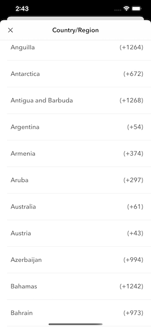
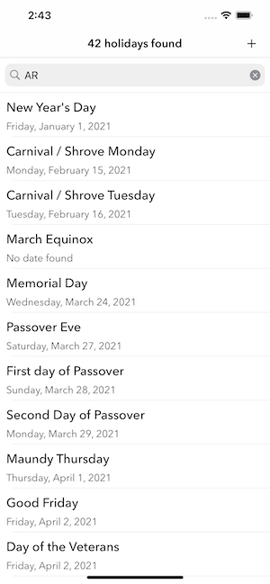

# HolidayApp

## Description
An app that displays all holidays of countries and states around the world.

## Core technologies ⚙️
* UITableView
* Network Requests with URLSession.

## Note 🚧:
This application was built using:
* macOS Sur 11.5.2
* Xcode 12.5.1
* MVC Pattern

## Screenshots 📲

Allows users to select a country of their choice

In HolidayApp, we shows a list of  holidays of the particular country

